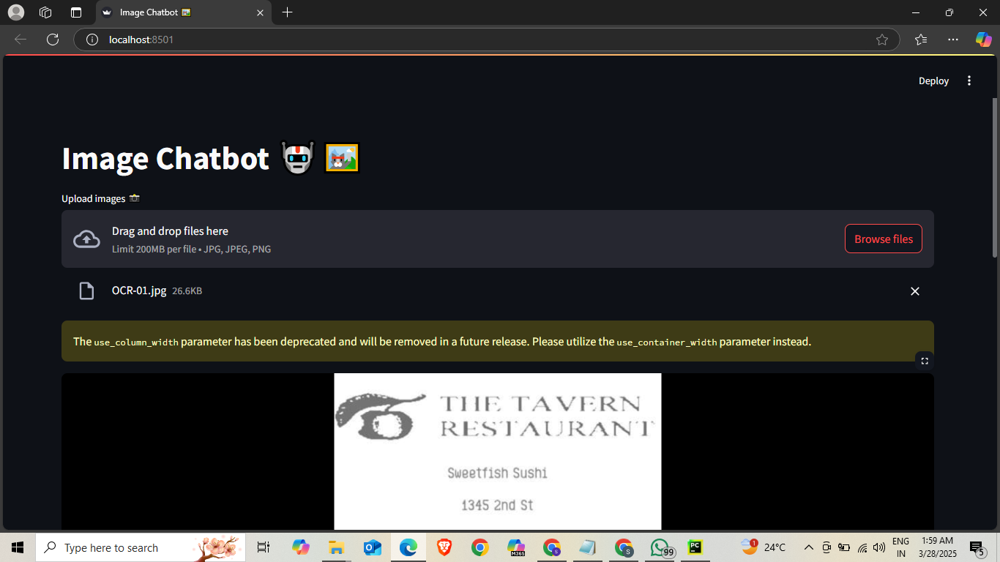
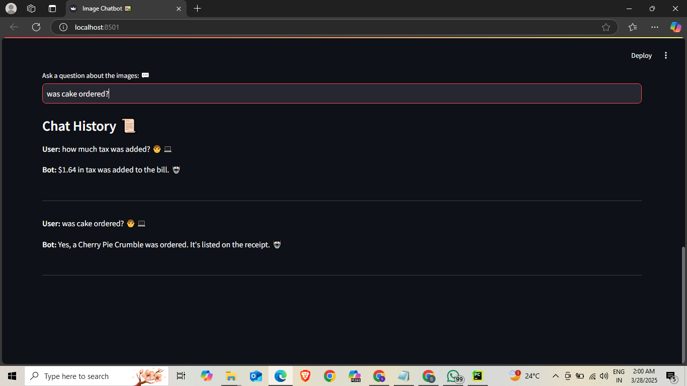

# VisionVerse: Chat Beyond Pixels 🌌🖼️

This Streamlit application allows users to upload images and engage in a conversational chat with an AI, powered by Google's Gemini API. The chatbot can answer questions based on the content of the uploaded images, taking the chat beyond the mere pixels.

## Features ✨

-   **Image Upload:** Users can upload one or multiple images (JPEG, PNG). 📸
-   **Chat Interface:** Users can ask questions about the uploaded images. 💬
-   **Multi-Image Support:** The chatbot can answer questions based on the content of all uploaded images. 🖼️🖼️
-   **Chat History:** The chat history is maintained and displayed, providing a conversational experience. 📜
-   **User-Friendly UI:** The Streamlit interface is designed to be intuitive and engaging. 🧑‍💻🤖
-   **Powered by Gemini API:** Uses Google's Gemini API for image analysis and text generation. 🧠

## Prerequisites 📋

-   Python 3.6+
-   Google Cloud API Key (for Gemini API)

## Installation 🔧

1.  **Clone the repository (if applicable):**

    ```bash
    git clone <repository_url>
    cd <repository_directory>
    ```

2.  **Install the required Python packages:**

    ```bash
    pip install streamlit google-generativeai
    ```

3.  **Set your Google Cloud API key:**

    Replace `"YOUR_GOOGLE_API_KEY"` in the `ocr.py` file with your actual API key.

## Usage 🚀

1.  **Run the Streamlit application:**

    ```bash
    streamlit run ocr.py
    ```

2.  **Open the application in your browser:**

    Streamlit will provide a local URL (e.g., `http://localhost:8501`). Open this URL in your web browser.

3.  **Upload images:**

    Use the "Upload images 📸" file uploader to select and upload your images.

4.  **Ask questions:**

    Enter your questions in the "Ask a question about the images: 💬" text input field.

5.  **View the chat history:**

    The chat history will be displayed below the input field.


## Screenshots 📸






